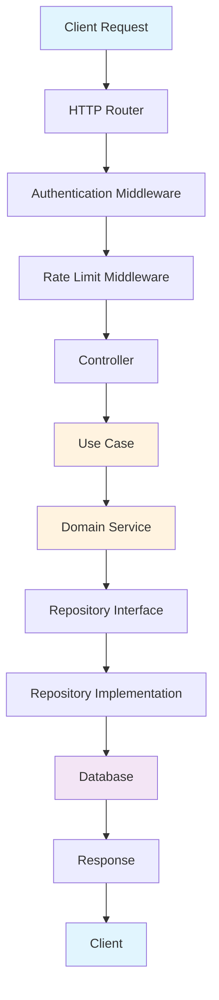
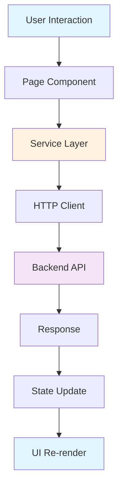

# 📋 Documentação Arquitetural - CRED30

## 🏗️ Visão Geral da Arquitetura

O projeto CRED30 foi reestruturado seguindo os princípios de **Clean Architecture** e **SOLID**, proporcionando uma separação clara de responsabilidades, baixo acoplamento e alta coesão.

## 🎯 Objetivos da Reestruturação

- ✅ **Separar responsabilidades** em camadas distintas
- ✅ **Facilitar testabilidade** com injeção de dependências
- ✅ **Promover reutilização** de código através de componentes modulares
- ✅ **Simplificar manutenção** com estrutura organizada
- ✅ **Garantir escalabilidade** com arquitetura flexível

## 📐 Estrutura de Camadas

### Backend - Clean Architecture

```
backend/src/
├── presentation/           # Camada de Apresentação
│   ├── http/
│   │   ├── controllers/     # Controllers HTTP
│   │   ├── middleware/      # Middleware de autenticação, rate limit
│   │   └── routes/          # Definição de rotas
│   └── graphql/             # Resolvers GraphQL (futuro)
├── application/             # Camada de Aplicação
│   ├── use-cases/          # Casos de uso (regras de negócio)
│   ├── dto/                # Data Transfer Objects
│   ├── validators/         # Validação de dados
│   └── mappers/            # Mapeamento entre camadas
├── domain/                 # Camada de Domínio (core)
│   ├── entities/           # Entidades de negócio
│   ├── repositories/       # Interfaces de repositórios
│   ├── services/           # Serviços de domínio
│   ├── value-objects/      # Objetos de valor
│   └── enums/              # Enumerações
├── infrastructure/         # Camada de Infraestrutura
│   ├── database/          # Implementações de banco
│   ├── external-services/  # APIs externas (PIX, email)
│   ├── cache/              # Redis, cache em memória
│   ├── logging/            # Logs e auditoria
│   └── security/           # JWT, criptografia
└── shared/                 # Código compartilhado
    ├── errors/             # Classes de erro customizadas
    ├── types/              # Tipos TypeScript
    ├── utils/              # Utilitários
    └── constants/          # Constantes da aplicação
```

### Frontend - Feature-Based Architecture

```
frontend/src/
├── presentation/           # Camada de Apresentação
│   ├── pages/             # Páginas da aplicação
│   ├── components/        # Componentes UI
│   │   ├── ui/            # Componentes genéricos
│   │   ├── features/      # Componentes específicos
│   │   ├── layout/        # Layout components
│   │   └── forms/         # Formulários
│   ├── hooks/             # Hooks React personalizados
│   └── providers/         # Context providers
├── application/           # Camada de Aplicação
│   ├── services/          # Serviços de API
│   ├── stores/            # State management
│   ├── mappers/           # Mapeamento de dados
│   └── validators/        # Validação frontend
├── domain/                # Camada de Domínio
│   ├── entities/          # Entidades frontend
│   ├── types/             # Tipos de domínio
│   ├── value-objects/     # Objetos de valor
│   └── enums/             # Enumerações
├── infrastructure/         # Camada de Infraestrutura
│   ├── http/              # Clientes HTTP
│   ├── storage/           # Local storage
│   └── notifications/     # Sistema de notificações
└── shared/                # Código compartilhado
    ├── constants/         # Constantes
    ├── utils/             # Utilitários
    ├── types/             # Tipos compartilhados
    └── errors/            # Tratamento de erros
```

## 🔄 Fluxo de Dados

### Backend - Request Flow



### Frontend - Component Interaction



## 🎨 Convenções de Nomenclatura

### Arquivos e Diretórios

- **Arquivos**: `kebab-case` (ex: `auth.controller.ts`)
- **Diretórios**: `kebab-case` (ex: `use-cases/`)
- **Componentes React**: `PascalCase` (ex: `AuthComponent.tsx`)
- **Constantes**: `UPPER_SNAKE_CASE` (ex: `API_BASE_URL`)

### Classes e Funções

- **Classes**: `PascalCase` (ex: `AuthController`)
- **Funções**: `camelCase` (ex: `authenticateUser`)
- **Interfaces**: `PascalCase` com sufixo `Interface` (ex: `UserRepositoryInterface`)
- **Types**: `PascalCase` com sufixo `Type` (ex: `UserType`)

## 🔧 Principais Componentes

### Backend

#### Controllers

- **AuthController**: Gerencia autenticação e autorização
- **UserController**: Operações de usuários
- **LoanController**: Gestão de empréstimos
- **QuotaController**: Operações com cotas
- **TransactionController**: Gestão de transações

#### Use Cases

- **AuthenticateUseCase**: Lógica de autenticação
- **CreateUserUseCase**: Criação de usuários
- **ProcessLoanUseCase**: Processamento de empréstimos
- **CalculateQuotaUseCase**: Cálculo de cotas

#### Entities

- **User**: Entidade de usuário com regras de negócio
- **Loan**: Entidade de empréstimo
- **Quota**: Entidade de cota
- **Transaction**: Entidade de transação

### Frontend

#### Pages

- **LoginPage**: Página de login
- **DashboardPage**: Dashboard principal
- **AdminDashboard**: Dashboard administrativo
- **LoanPage**: Página de empréstimos

#### Components

- **Modal**: Componente genérico de modal
- **MetricCard**: Card de métricas
- **DataTable**: Tabela de dados genérica
- **FormInput**: Input de formulário

## 🔐 Segurança

### Autenticação

- **JWT Tokens**: Tokens JWT para autenticação stateless
- **Refresh Tokens**: Tokens de atualização para sessões longas
- **Role-based Access**: Controle de acesso baseado em papéis

### Validação

- **Input Validation**: Validação rigorosa de entrada
- **SQL Injection Prevention**: Uso de prepared statements
- **XSS Protection**: Sanitização de dados de usuário

## 📊 Performance

### Backend

- **Connection Pooling**: Pool de conexões PostgreSQL
- **Redis Cache**: Cache para dados frequentemente acessados
- **Rate Limiting**: Limitação de taxa por usuário
- **Database Indexing**: Índices otimizados

### Frontend

- **Code Splitting**: Divisão de código por rotas
- **Lazy Loading**: Carregamento sob demanda
- **Memoization**: Otimização de renderização
- **Bundle Optimization**: Minificação e compressão

## 🧪 Testes

### Backend

- **Unit Tests**: Testes de unidade para use cases e entities
- **Integration Tests**: Testes de integração com banco
- **E2E Tests**: Testes end-to-end da API

### Frontend

- **Component Tests**: Testes de componentes React
- **Hook Tests**: Testes de hooks personalizados
- **E2E Tests**: Testes de fluxos completos

## 🚀 Deploy

### Backend

- **Docker Containers**: Contêineres para isolamento
- **Environment Variables**: Configuração por ambiente
- **Health Checks**: Verificação de saúde da aplicação
- **Load Balancing**: Balanceamento de carga

### Frontend

- **Static Hosting**: Hospedagem de arquivos estáticos
- **CDN**: Content Delivery Network
- **Asset Optimization**: Otimização de assets
- **Progressive Web App**: Recursos PWA

## 📈 Monitoramento

### Logs

- **Structured Logging**: Logs estruturados com contexto
- **Log Levels**: Níveis de log (debug, info, warn, error)
- **Audit Logs**: Logs de auditoria para conformidade

### Métricas

- **Response Time**: Tempo de resposta das APIs
- **Error Rate**: Taxa de erros
- **Throughput**: Volume de requisições
- **Resource Usage**: Uso de CPU e memória

## 🔄 Ciclo de Vida

### Desenvolvimento

1. **Feature Branch**: Branch por funcionalidade
2. **Code Review**: Revisão de código obrigatória
3. **Automated Tests**: Testes automatizados no CI/CD
4. **Deployment**: Deploy automatizado

### Manutenção

1. **Regular Updates**: Atualizações de segurança
2. **Performance Monitoring**: Monitoramento contínuo
3. **User Feedback**: Feedback dos usuários
4. **Continuous Improvement**: Melhoria contínua

## 📚 Recursos Adicionais

### Documentação

- [API Documentation](./docs/api.md)
- [Database Schema](./docs/database.md)
- [Deployment Guide](./docs/deployment.md)
- [Development Setup](./docs/development.md)

### Ferramentas

- **TypeScript**: Tipagem estática
- **ESLint**: Linting de código
- **Prettier**: Formatação de código
- **Husky**: Git hooks

---

**Última atualização**: Dezembro 2024
**Versão**: 2.0.0
**Arquitetura**: Clean Architecture + SOLID
