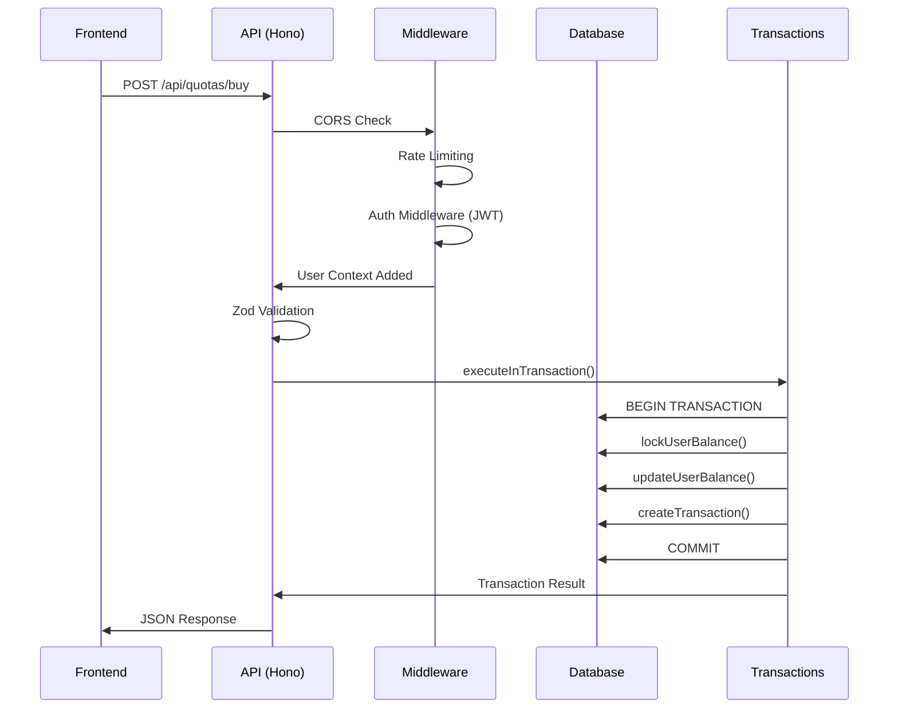

# Lógica de Funcionamento: Comunicação Cliente-Backend

## Índice

1. [Arquitetura Geral do Sistema](#arquitetura-geral-do-sistema)
2. [Fluxo de Autenticação](#fluxo-de-autenticação)
3. [Comunicação HTTP](#comunicação-http)
4. [Middleware e Segurança](#middleware-e-segurança)
5. [Processamento de Requisições](#processamento-de-requisições)
6. [Transações e Integridade de Dados](#transações-e-integridade-de-dados)
7. [Fluxos de Negócio Específicos](#fluxos-de-negócio-específicos)
8. [Tratamento de Erros e Respostas](#tratamento-de-erros-e-respostas)

---

## Arquitetura Geral do Sistema

### Stack Tecnológico

**Backend:**

- **Framework**: Hono (framework web leve para TypeScript/JavaScript)
- **Banco de Dados**: PostgreSQL com pool de conexões
- **Autenticação**: JWT (JSON Web Tokens)
- **Validação**: Zod para validação de schemas
- **Runtime**: Bun (runtime JavaScript)

**Frontend:**

- **Framework**: React com TypeScript
- **Estado**: useState e useEffect para gerenciamento local
- **HTTP Cliente**: Fetch API com serviço centralizado
- **Estilização**: Tailwind CSS

### Estrutura do Backend

```
backend/src/
├── index.ts              # Ponto de entrada e configuração do servidor
├── routes/               # Definição das rotas da API
│   ├── auth.ts          # Rotas de autenticação
│   ├── quotas.ts        # Rotas de operações com cotas
│   ├── loans.ts         # Rotas de empréstimos
│   ├── transactions.ts  # Rotas de transações
│   └── admin.ts         # Rotas administrativas
├── middleware/           # Middleware de autenticação e segurança
│   ├── auth.ts          # Middleware de autenticação JWT
│   └── rateLimit.ts     # Middleware de rate limiting
├── utils/               # Utilitários e helpers
│   ├── db.ts            # Configuração do banco de dados
│   └── transactions.ts  # Funções de transações ACID
└── models/              # Definição de modelos de dados
```

### Inicialização do Servidor

O servidor é iniciado em [`backend/src/index.ts`](backend/src/index.ts:20):

```typescript
async function startServer() {
  try {
    // 1. Inicializar o banco de dados e criar tabelas
    await initializeDatabase();

    // 2. Disponibilizar o pool de conexões PostgreSQL para as rotas
    setDbPool(pool);

    // 3. Configurar rotas da API
    app.route("/api/auth", authRoutes);
    app.route("/api/users", userRoutes);
    app.route("/api/quotas", quotaRoutes);
    app.route("/api/loans", loanRoutes);
    app.route("/api/transactions", transactionRoutes);
    app.route("/api/admin", adminRoutes);

    // 4. Iniciar servidor HTTP
    return Bun.serve({
      fetch: app.fetch,
      port: Number(port),
    });
  } catch (error) {
    console.error("Erro ao conectar ao PostgreSQL:", error);
    process.exit(1);
  }
}
```

---

## Fluxo de Autenticação

### 1. Login do Usuário

**Frontend → Backend:**

```typescript
// Frontend (services/apiService.ts)
async login(email: string, password: string, secretPhrase: string): Promise<AuthResponse> {
  const response = await this.request<AuthResponse>('/auth/login', {
    method: 'POST',
    body: JSON.stringify({ email, password, secretPhrase }),
  });

  // Armazenar token
  this.token = response.data?.token || null;
  if (this.token) {
    localStorage.setItem('authToken', this.token);
  }

  return response.data!;
}
```

**Backend Processamento:**

```typescript
// Backend (backend/src/routes/auth.ts)
authRoutes.post("/login", async (c) => {
  try {
    const body = await c.req.json();
    const validatedData = loginSchema.parse(body);

    // Verificar login de administrador hardcoded
    if (
      validatedData.email === "admin@cred30.com" &&
      validatedData.password === "admin123" &&
      validatedData.secretPhrase === "admin"
    ) {
      const token = sign(
        { userId: adminUser.id, isAdmin: true },
        process.env.JWT_SECRET || "default_secret",
        { expiresIn: "24h" }
      );

      return c.json({
        success: true,
        message: "Login realizado com sucesso",
        data: { user: adminUser, token },
      });
    }

    // Buscar usuário no banco
    const result = await pool.query(
      "SELECT id, name, email, password, secret_phrase, pix_key, balance, created_at, referral_code, is_admin FROM users WHERE email = $1",
      [validatedData.email]
    );

    // Verificar credenciais
    const isPasswordValid = user.password
      ? await bcrypt.compare(validatedData.password, user.password)
      : validatedData.password === user.password;

    if (!isPasswordValid || user.secret_phrase !== validatedData.secretPhrase) {
      return c.json({ success: false, message: "Credenciais inválidas" }, 401);
    }

    // Gerar token JWT
    const token = sign(
      { userId: user.id, isAdmin: user.is_admin },
      process.env.JWT_SECRET || "default_secret",
      { expiresIn: "24h" }
    );

    return c.json({
      success: true,
      message: "Login realizado com sucesso",
      data: { user: formattedUser, token },
    });
  } catch (error) {
    // Tratamento de erros
  }
});
```

### 2. Middleware de Autenticação

Todas as rotas protegidas passam pelo middleware de autenticação em [`backend/src/middleware/auth.ts`](backend/src/middleware/auth.ts:6):

```typescript
export const authMiddleware: MiddlewareHandler = async (c, next) => {
  try {
    // 1. Extrair token do header Authorization
    const authHeader = c.req.header("Authorization");

    if (!authHeader || !authHeader.startsWith("Bearer ")) {
      return c.json({ success: false, message: "Token não fornecido" }, 401);
    }

    const token = authHeader.substring(7); // Remove "Bearer "

    // 2. Verificar e decodificar token JWT
    const decoded = verify(
      token,
      process.env.JWT_SECRET || "default_secret"
    ) as any;

    if (!decoded || !decoded.userId) {
      return c.json({ success: false, message: "Token inválido" }, 401);
    }

    // 3. Buscar usuário no banco para obter dados atualizados
    const pool = getDbPool(c);
    const result = await pool.query(
      "SELECT id, name, email, balance, referral_code, is_admin, created_at, pix_key FROM users WHERE id = $1",
      [decoded.userId]
    );

    if (result.rows.length === 0) {
      return c.json({ success: false, message: "Usuário não encontrado" }, 404);
    }

    // 4. Adicionar usuário ao contexto da requisição
    const userContext: UserContext = {
      id: user.id,
      name: user.name,
      email: user.email,
      balance: parseFloat(user.balance),
      joinedAt: new Date(user.created_at).getTime(),
      referralCode: user.referral_code,
      isAdmin: user.is_admin === true,
      pixKey: user.pix_key,
    };

    c.set("user", userContext);
    await next();
  } catch (error) {
    return c.json(
      { success: false, message: "Token inválido ou expirado" },
      401
    );
  }
};
```

---

## Comunicação HTTP

### Estrutura das Requisições

**Formato Padrão de Requisições:**

```typescript
// Frontend envia:
{
  method: 'POST',
  headers: {
    'Content-Type': 'application/json',
    'Authorization': 'Bearer <jwt_token>'
  },
  body: JSON.stringify({
    // dados da requisição
  })
}
```

**Formato Padrão de Respostas:**

```typescript
// Backend responde:
{
  success: boolean,
  message: string,
  data?: any,        // dados em caso de sucesso
  errors?: any[]      // erros de validação
}
```

### Exemplo: Compra de Cotas

**Frontend:**

```typescript
// services/apiService.ts
async buyQuotas(quantity: number, useBalance: boolean): Promise<any> {
  const response = await this.request<any>('/quotas/buy', {
    method: 'POST',
    body: JSON.stringify({ quantity, useBalance }),
  });
  return response.data;
}

// App.tsx
const handleBuyQuota = async (qty: number, method: 'PIX' | 'BALANCE') => {
  try {
    await buyQuota(qty, method === 'BALANCE');
    await refreshState();
    alert(`Solicitação de compra enviada! Aguarde a aprovação do administrador.`);
    setCurrentView('dashboard');
  } catch (e: any) {
    alert(e.message);
  }
};
```

**Backend:**

```typescript
// backend/src/routes/quotas.ts
quotaRoutes.post("/buy", authMiddleware, async (c) => {
  try {
    const body = await c.req.json();
    const { quantity, useBalance } = buyQuotaSchema.parse(body);

    const user = c.get("user") as UserContext;
    const pool = getDbPool(c);

    const cost = quantity * QUOTA_PRICE;

    // Executar operação dentro de transação ACID
    const result = await executeInTransaction(pool, async (client) => {
      // Se estiver usando saldo, verificar e bloquear
      if (useBalance) {
        const balanceCheck = await lockUserBalance(client, user.id, cost);
        if (!balanceCheck.success) {
          throw new Error(balanceCheck.error);
        }

        // Deduzir saldo
        const updateResult = await updateUserBalance(
          client,
          user.id,
          cost,
          "debit"
        );
        if (!updateResult.success) {
          throw new Error(updateResult.error);
        }
      }

      // Criar transação pendente
      const transactionResult = await createTransaction(
        client,
        user.id,
        "BUY_QUOTA",
        cost,
        `Compra de ${quantity} cota(s) - Aguardando Aprovação`,
        "PENDING",
        { quantity, useBalance }
      );

      return {
        transactionId: transactionResult.transactionId,
        cost,
        quantity,
      };
    });

    return c.json({
      success: true,
      message:
        "Solicitação de compra enviada! Aguarde a aprovação do administrador.",
      data: result.data,
    });
  } catch (error) {
    return c.json(
      {
        success: false,
        message:
          error instanceof Error ? error.message : "Erro interno do servidor",
      },
      500
    );
  }
});
```

---

## Middleware e Segurança

### 1. CORS (Cross-Origin Resource Sharing)

Configurado em [`backend/src/index.ts`](backend/src/index.ts:14):

```typescript
app.use(
  "*",
  cors({
    origin: [
      "http://localhost:3000",
      "http://127.0.0.1:3000",
      "http://localhost:3001",
      "http://localhost:3002",
      "http://localhost:3003",
    ],
    allowMethods: ["GET", "POST", "PUT", "DELETE", "OPTIONS"],
    allowHeaders: ["Content-Type", "Authorization"],
  })
);
```

### 2. Rate Limiting

Proteção contra ataques de força bruta e abuso:

```typescript
// backend/src/routes/auth.ts
authRoutes.post("/login", authRateLimit);
authRoutes.post("/register", authRateLimit);
authRoutes.post("/reset-password", authRateLimit);

// backend/src/routes/quotas.ts
quotaRoutes.use("/buy", financialRateLimit);
quotaRoutes.use("/sell", financialRateLimit);
quotaRoutes.use("/sell-all", financialRateLimit);
```

### 3. Validação de Dados

Uso do Zod para validação rigorosa dos dados de entrada:

```typescript
// backend/src/routes/auth.ts
const loginSchema = z.object({
  email: z.string().email(),
  password: z.string().min(6),
  secretPhrase: z.string().min(3),
});

// backend/src/routes/quotas.ts
const buyQuotaSchema = z.object({
  quantity: z.number().int().positive(),
  useBalance: z.boolean(),
});
```

---

## Processamento de Requisições

### Ciclo de Vida de uma Requisição

1. **Recepção**: Hono recebe a requisição HTTP
2. **Middleware Global**: CORS é aplicado
3. **Middleware de Rota**: Rate limiting (se aplicável)
4. **Middleware de Autenticação**: Verificação JWT (se rota protegida)
5. **Validação**: Zod valida os dados de entrada
6. **Processamento**: Lógica de negócio é executada
7. **Transação**: Operações no banco são realizadas
8. **Resposta**: Resultado é formatado e retornado

### Exemplo: Fluxo Completo de Compra



---

## Transações e Integridade de Dados

### Sistema de Transações ACID

O backend implementa um sistema robusto de transações em [`backend/src/utils/transactions.ts`](backend/src/utils/transactions.ts):

```typescript
export const executeInTransaction = async (
  pool: Pool,
  callback: (client: PoolClient) => Promise<any>
): Promise<{ success: boolean; data?: any; error?: string }> => {
  const client = await pool.connect();
  try {
    await client.query("BEGIN");

    const result = await callback(client);

    await client.query("COMMIT");

    return { success: true, data: result };
  } catch (error) {
    await client.query("ROLLBACK");

    console.error("Erro na transação:", error);
    return {
      success: false,
      error: error instanceof Error ? error.message : "Erro desconhecido",
    };
  } finally {
    client.release();
  }
};
```

### Bloqueio de Saldo

Para evitar condições de corrida, o sistema implementa bloqueio de saldo:

```typescript
export const lockUserBalance = async (
  client: PoolClient,
  userId: number,
  amount: number
): Promise<{ success: boolean; error?: string }> => {
  try {
    const result = await client.query(
      "SELECT balance FROM users WHERE id = $1 FOR UPDATE",
      [userId]
    );

    if (result.rows.length === 0) {
      return { success: false, error: "Usuário não encontrado" };
    }

    const currentBalance = parseFloat(result.rows[0].balance);

    if (currentBalance < amount) {
      return { success: false, error: "Saldo insuficiente" };
    }

    return { success: true };
  } catch (error) {
    return {
      success: false,
      error: error instanceof Error ? error.message : "Erro ao verificar saldo",
    };
  }
};
```

---

## Fluxos de Negócio Específicos

### 1. Registro de Usuário com Indicação

```typescript
// backend/src/routes/auth.ts
// Verificar código de indicação e aplicar bônus
if (validatedData.referralCode) {
  const referrerResult = await pool.query(
    "SELECT id FROM users WHERE referral_code = $1",
    [validatedData.referralCode.toUpperCase()]
  );

  if (referrerResult.rows.length > 0) {
    const referrerId = referrerResult.rows[0].id;

    // Aplicar bônus de indicação
    await pool.query("UPDATE users SET balance = balance + $1 WHERE id = $2", [
      5.0,
      referrerId,
    ]);

    // Registrar transação de bônus
    await pool.query(
      "INSERT INTO transactions (user_id, type, amount, description, status) VALUES ($1, $2, $3, $4)",
      [
        referrerId,
        "REFERRAL_BONUS",
        5.0,
        `Bônus indicação: ${validatedData.name}`,
        "APPROVED",
      ]
    );
  }
}
```

### 2. Venda de Cotas com Multa

```typescript
// backend/src/routes/quotas.ts
// Calcular valor de resgate
const now = Date.now();
const timeDiff = now - new Date(quota.purchase_date).getTime();
const isEarlyExit = timeDiff < VESTING_PERIOD_MS; // 1 ano

let finalAmount = parseFloat(quota.purchase_price);
let penaltyAmount = 0;

if (isEarlyExit) {
  penaltyAmount = finalAmount * PENALTY_RATE; // 40%
  finalAmount = finalAmount - penaltyAmount;
}

// Remover cota e creditar saldo
await pool.query("DELETE FROM quotas WHERE id = $1 AND user_id = $2", [
  parseInt(quotaId),
  user.id,
]);
await pool.query("UPDATE users SET balance = balance + $1 WHERE id = $2", [
  finalAmount,
  user.id,
]);
```

### 3. Sistema de Aprovação Administrativa

Operações críticas como compras de cotas e empréstimos ficam pendentes até aprovação:

```typescript
// Criar transação pendente
const transactionResult = await createTransaction(
  client,
  user.id,
  "BUY_QUOTA",
  cost,
  `Compra de ${quantity} cota(s) - Aguardando Aprovação`,
  "PENDING",
  { quantity, useBalance }
);
```

O administrador pode aprovar ou rejeitar através do painel:

```typescript
// backend/src/routes/admin.ts
adminRoutes.post(
  "/process-action",
  authMiddleware,
  adminMiddleware,
  async (c) => {
    try {
      const { id, type, action } = await c.req.json();

      if (type === "TRANSACTION") {
        if (action === "APPROVE") {
          // Aprovar transação e efetivar operação
        } else if (action === "REJECT") {
          // Rejeitar e estornar valores se necessário
        }
      } else if (type === "LOAN") {
        // Processar aprovação/rejeição de empréstimo
      }
    } catch (error) {
      // Tratamento de erros
    }
  }
);
```

---

## Tratamento de Erros e Respostas

### Estrutura de Erros Padronizada

O backend utiliza uma estrutura consistente para tratamento de erros:

```typescript
// Erros de validação
if (error instanceof z.ZodError) {
  return c.json(
    {
      success: false,
      message: "Dados inválidos",
      errors: error.errors,
    },
    400
  );
}

// Erros de negócio
return c.json(
  {
    success: false,
    message:
      error instanceof Error ? error.message : "Erro interno do servidor",
  },
  400
);

// Erros internos do servidor
console.error("Erro na operação:", error);
return c.json(
  {
    success: false,
    message: "Erro interno do servidor",
  },
  500
);
```

### Logging e Monitoramento

O sistema implementa logging detalhado para debugging e auditoria:

```typescript
// Middleware de autenticação
console.log("authMiddleware - Header:", authHeader);
console.log("authMiddleware - Token extraído:", token.substring(0, 20) + "...");
console.log("authMiddleware - Token decodificado:", {
  userId: decoded?.userId,
  isAdmin: decoded?.isAdmin,
  hasUserId: !!decoded?.userId,
});

// Rotas de negócio
console.log("Buscando usuário com email:", validatedData.email);
console.log("Resultado da consulta:", result.rows);
```

---

## Resumo do Fluxo Completo

### 1. Inicialização

- Backend inicia com Hono + Bun
- Conecta ao PostgreSQL e inicializa tabelas
- Configura middleware globais (CORS, rate limiting)

### 2. Autenticação

- Cliente envia credenciais para `/api/auth/login`
- Backend valida e gera token JWT
- Cliente armazena token e envia em requisições subsequentes

### 3. Operações Protegidas

- Cliente inclui token no header `Authorization: Bearer <token>`
- Middleware de autenticação valida token e adiciona usuário ao contexto
- Middleware de rate limiting previne abuso
- Zod valida dados de entrada

### 4. Processamento de Negócio

- Operações críticas usam transações ACID
- Sistema de bloqueio previne condições de corrida
- Operações financeiras criam transações pendentes

### 5. Aprovação Administrativa

- Administrador aprova/rejeita operações pendentes
- Sistema efetiva ou estorna valores conforme necessário
- Auditoria completa de todas as operações

### 6. Respostas

- Backend retorna respostas JSON padronizadas
- Cliente atualiza estado local com novos dados
- Interface re-renderiza com informações atualizadas

Esta arquitetura garante segurança, integridade dos dados e uma experiência de usuário robusta, com separação clara de responsabilidades e tratamento adequado de erros.
