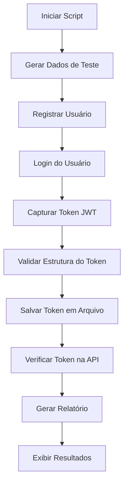

# Script de Teste de Autenticação - Cred30

## Descrição

Este script automatizado realiza o fluxo completo de cadastro e autenticação de clientes no sistema Cred30, incluindo validação de tokens JWT e armazenamento persistente.

## Funcionalidades

- ✅ **Registro de Usuário**: Criação automática de novos usuários com dados aleatórios
- ✅ **Autenticação**: Login completo com validação de credenciais
- ✅ **Token JWT**: Captura e validação estrutural de tokens
- ✅ **Armazenamento**: Salvamento automático de tokens com timestamp
- ✅ **Verificação**: Testes completos de validação do token salvo
- ✅ **Tratamento de Erros**: Captura robusta de falhas de comunicação e validação
- ✅ **Relatórios**: Geração de relatórios detalhados em JSON
- ✅ **Testes Múltiplos**: Suporte para testes simultâneos com múltiplos usuários

## Pré-requisitos

- Node.js >= 18.0.0
- Servidor backend Cred30 rodando em `http://localhost:3001`

## Instalação

1. **Instalar dependências** (se necessário):

```bash
npm install --package-lock-only
# ou usando o package específico
npm install --package-lock-only --package package-test.json
```

2. **Verificar se o backend está rodando**:

```bash
# O backend deve estar acessível em http://localhost:3001
curl http://localhost:3001/api/health
```

## Uso

### Teste Simples (Fluxo Completo)

```bash
# Executar fluxo completo de autenticação
node test-auth-flow.js

# Ou usando o script npm
npm run test
```

### Teste com Múltiplos Usuários

```bash
# Testar com 3 usuários simultâneos (padrão)
node test-auth-flow.js --multiple

# Testar com 5 usuários simultâneos
node test-auth-flow.js --multiple 5

# Ou usando o script npm
npm run test:multiple
```

### Ajuda

```bash
# Mostrar opções disponíveis
node test-auth-flow.js --help

# Ou usando o script npm
npm run help
```

## Estrutura do Script

### Componentes Principais

1. **Gerador de Dados**: Cria dados aleatórios para teste
2. **Cliente HTTP**: Realiza requisições com timeout e tratamento de erros
3. **Validador de Respostas**: Verifica estrutura das respostas da API
4. **Validador JWT**: Analisa estrutura e validade de tokens
5. **Gerenciador de Tokens**: Salva e carrega tokens do arquivo JSON
6. **Sistema de Testes**: Executa verificações automatizadas

### Fluxo de Execução



## Arquivos Gerados

### 1. `auth-tokens.json`

Armazena os tokens JWT gerados durante os testes:

```json
{
  "tokens": [
    {
      "id": 1703123456789,
      "timestamp": "2023-12-21T15:30:00.000Z",
      "user": {
        "id": 123,
        "name": "Usuário Teste 1703123456789",
        "email": "test1703123456789@example.com",
        "balance": 0,
        "referralCode": "ABC123"
      },
      "token": "eyJhbGciOiJIUzI1NiIsInR5cCI6IkpXVCJ9...",
      "tokenPayload": {
        "userId": 123,
        "isAdmin": false,
        "exp": 1703209860,
        "iat": 1703123460
      },
      "source": "auth-flow-test",
      "userData": {
        "name": "Usuário Teste 1703123456789",
        "email": "test1703123456789@example.com"
      }
    }
  ],
  "lastUpdated": "2023-12-21T15:30:00.000Z"
}
```

### 2. `auth-test-report-[timestamp].json`

Relatório detalhado de cada execução:

```json
{
  "startTime": "2023-12-21T15:30:00.000Z",
  "endTime": "2023-12-21T15:30:05.000Z",
  "success": true,
  "userData": {
    "name": "Usuário Teste 1703123456789",
    "email": "test1703123456789@example.com",
    "password": "senha123",
    "secretPhrase": "frase1703123456789",
    "pixKey": "test1703123456789@pix.com"
  },
  "registration": {
    "user": {
      /* dados do usuário */
    },
    "token": "eyJhbGciOiJIUzI1NiIsInR5cCI6IkpXVCJ9...",
    "tokenPayload": {
      /* payload do token */
    }
  },
  "login": {
    "user": {
      /* dados do usuário */
    },
    "token": "eyJhbGciOiJIUzI1NiIsInR5cCI6IkpXVCJ9...",
    "tokenPayload": {
      /* payload do token */
    }
  },
  "tokenSaved": {
    "id": 1703123456789,
    "timestamp": "2023-12-21T15:30:00.000Z"
  },
  "verification": {
    "fileExists": true,
    "tokenValid": true,
    "tokenStructureValid": true,
    "apiAccessValid": true
  },
  "errors": []
}
```

## Testes de Verificação

O script executa os seguintes testes automáticos:

### 1. ✅ Verificação de Arquivo

- Confirma que `auth-tokens.json` foi criado
- Valida estrutura do conteúdo
- Verifica quantidade de tokens armazenados

### 2. ✅ Estrutura do Token

- Valida formato JWT (3 partes)
- Decodifica e valida payload
- Verifica campos obrigatórios (userId, exp)
- Confirma que o token não está expirado

### 3. ✅ Acesso à API

- Tenta acessar endpoint protegido `/api/users/profile`
- Verifica se o token é aceito pelo backend
- Confirma retorno dos dados do usuário

## Tratamento de Erros

### Erros de Comunicação

- **Timeout**: Requisições com mais de 10 segundos são canceladas
- **Network Error**: Falhas de conectividade são capturadas
- **HTTP Errors**: Status codes diferentes de 2xx são tratados

### Erros de Validação

- **Resposta Inválida**: Estrutura JSON malformada
- **Campos Ausentes**: Verificação de campos obrigatórios
- **Token Inválido**: Formato JWT incorreto ou expirado

### Erros de Negócio

- **Usuário Duplicado**: Email já cadastrado
- **Credenciais Inválidas**: Senha ou frase secreta incorretas
- **API Errors**: Mensagens de erro retornadas pelo backend

## Exemplos de Uso

### Exemplo 1: Teste Básico

```bash
$ node test-auth-flow.js

[INFO] Dados de teste gerados:
[RESULT] Nome: Usuário Teste 1703123456789
[RESULT] Email: test1703123456789@example.com

[STEP] Iniciando registro de novo usuário...
[INFO] Fazendo requisição para: http://localhost:3001/api/auth/register
[SUCCESS] Requisição bem-sucedida: 201
[SUCCESS] Usuário registrado com sucesso!
[RESULT] ID do usuário: 123
[RESULT] Email: test1703123456789@example.com
[RESULT] Token expira em: 22/12/2023 15:30:00

[STEP] Iniciando autenticação de usuário...
[INFO] Fazendo requisição para: http://localhost:3001/api/auth/login
[SUCCESS] Requisição bem-sucedida: 200
[SUCCESS] Usuário autenticado com sucesso!
[RESULT] ID do usuário: 123
[RESULT] Email: test1703123456789@example.com
[RESULT] Token expira em: 22/12/2023 15:30:00

[SUCCESS] Token salvo em: ./auth-tokens.json

[STEP] Iniciando testes de verificação do token...
[SUCCESS] ✓ Arquivo de tokens criado com sucesso
[RESULT] ✓ Total de tokens armazenados: 1
[SUCCESS] ✓ Estrutura do token JWT válida
[RESULT] ✓ UserID: 123
[RESULT] ✓ Expira em: 22/12/2023 15:30:00
[SUCCESS] ✓ Token válido para acesso à API
[SUCCESS] ✓ Perfil do usuário carregado: Usuário Teste 1703123456789

🎉 Todos os 4 testes passaram com sucesso!

🎉 Fluxo de autenticação concluído com sucesso!

📄 Relatório completo salvo em: ./auth-test-report-1703123456789.json

=== Resumo do Teste ===
Início: 2023-12-21T15:30:00.000Z
Fim: 2023-12-21T15:30:05.000Z
Status: ✅ SUCESSO
```

### Exemplo 2: Teste com Erro

```bash
$ node test-auth-flow.js

[ERROR] Falha no registro: HTTP 409: Email já cadastrado
[ERROR] Falha no fluxo de autenticação: Email já cadastrado

=== Resumo do Teste ===
Início: 2023-12-21T15:35:00.000Z
Fim: 2023-12-21T15:35:02.000Z
Status: ❌ FALHA

Erros encontrados:
1. Registro: Email já cadastrado
```

## Configuração

### Variáveis de Ambiente

Você pode configurar as seguintes variáveis de ambiente:

```bash
# URL da API (padrão: http://localhost:3001/api)
export API_BASE_URL="http://localhost:3001/api"

# Arquivo de tokens (padrão: ./auth-tokens.json)
export TOKENS_FILE="./custom-tokens.json"
```

### Personalização

O script pode ser facilmente personalizado modificando:

- **URL da API**: Alterar constante `API_BASE_URL`
- **Timeout**: Modificar valor em `makeRequest()`
- **Dados de Teste**: Personalizar função `generateTestData()`
- **Validações**: Adicionar novos critérios em `validateResponse()`

## Troubleshooting

### Problema: "ECONNREFUSED"

**Causa**: Backend não está rodando
**Solução**: Inicie o servidor backend

```bash
cd backend
npm run dev
```

### Problema: "Timeout: A requisição demorou demais"

**Causa**: Backend lento ou indisponível
**Solução**: Verifique o status do backend ou aumente o timeout

### Problema: "Token inválido: payload não é JSON válido"

**Causa**: Token malformado ou corrompido
**Solução**: Verifique o arquivo `auth-tokens.json` e delete se necessário

### Problema: "Module not found"

**Causa**: Dependências não instaladas
**Solução**: Instale as dependências necessárias

```bash
npm install
```

## Contribuição

Para contribuir com melhorias:

1. Faça um fork do projeto
2. Crie uma branch para sua feature
3. Implemente as mudanças
4. Adicione testes se necessário
5. Envie um pull request

## Licença

MIT License - veja o arquivo LICENSE para detalhes.
